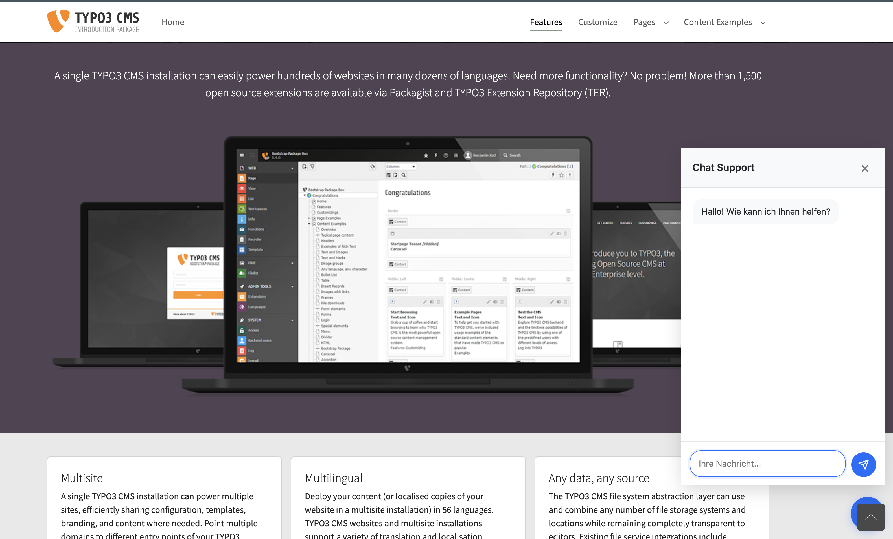

# TYPO3 OpenAI Chatbot Extension

## Overview

The OpenAI Chatbot Extension integrates an AI-powered chatbot into TYPO3 websites. The extension uses the OpenAI API and supports persistent conversations through session management.



## Features

- 🤖 Interactive AI chatbot based on OpenAI's GPT models
- 💬 Session-based conversations
- 📱 Fully responsive design
- ⚙️ Extensive configuration options
- 🔒 Secure API communication
- 📝 Markdown & HTML formatting
- 🎨 Customizable styling

## System requirements

- TYPO3 12.4 LTS or higher
- PHP 8.2 or higher
- OpenAI API Key
- Composer

## Installation

### Via Composer

```bash
composer require mannimedia/openai-chatbot
```

### Manually

1. Download extension from the TYPO3 Extension Repository
2. Extension in the Extension Manager activate
3. Include Static TypoScript Template
4. Empty TYPO3 and PHP cache

## Configuration

### TypoScript Setup

```typoscript
plugin.tx_openaichatbot {
settings {
apiKey = {$plugin.tx_openaichatbot.settings.apiKey}
model = gpt-4-turbo-preview
temperature = 0.7
maxTokens = 1000
}
}
```

### Environment variables

Settings in the extension

```env
OPENAI_API_KEY=your-api-key-here
```

## Integration

### As content element

1. Create new content element
2. Select "Plugins" tab
3. Select "OpenAI Chatbot"
4. Adjust configuration options as required

### Via TypoScript

```typoscript
page.10 = FLUIDTEMPLATE
page.10 {
file = EXT:your_sitepackage/Resources/Private/Templates/Page/Default.html
variables {
chatbot = USER
chatbot {
userFunc = TYPO3\CMS\Extbase\Core\Bootstrap->run
extensionName = OpenaiChatbot
pluginName = Chat
vendorName = Mannimedia
}
}
}
```

## Styling

The styling can be customized via SCSS/CSS:

```scss
.tx-openai-chatbot {
// Your individual styling adjustments
}
```

## API reference

### Available endpoints

### Request format

```json
{
"tx_openaichatbot_chat": {
"message": "User message",
"threadId": "optional-thread-id" 
}
}
```

### Response format

```json
{
 "success": true,
 "response": {
 "message": "AI response",
 "threadId": "generated-thread-id"
 }
}
```

## Development

### Build Process

```bash
# Install dependencies
composer install

# Build assets
npm install
npm run build

# Run tests
composer test
```

### Coding standards

The extension follows the TYPO3 coding guidelines. Check your code with:

```bash
composer check-style
composer fix-style
```

## Troubleshooting

### Known issues

1. API connection errors

- Check API key

- Test network connection

- Check firewall settings

2. Session issues

- Clear cache

- Check session storage

- Verify PHP session settings

## Support

- 📫 [GitHub Issues](https://github.com/mannimedia/openai-chatbot/issues)

- 💬 [TYPO3 Slack Channel](#)

- 📚 [Detailed documentation](https://docs.typo3.org/p/mannimedia/openai-chatbot/main/en-us/)

## Contribute

Contributions are welcome! Please read our [Contribution Guidelines](CONTRIBUTING.md).

1. Fork the project
2. Create your feature branch (`git checkout -b feature/AmazingFeature`)
3. Commit your changes (`git commit -m 'Add some AmazingFeature'`)
4. Push to the branch (`git push origin feature/AmazingFeature`)
5. Open a pull request

## License

Copyright © 2024 [Your Name/Company]

This project is licensed under the MIT License - see the [LICENSE.md](LICENSE.md) file for details.

## Credits

- Developed by [Your Name/Company]
- Powered by [OpenAI](https://openai.com)
- Built for [TYPO3 CMS](https://typo3.org)

---

Made with ❤️ for TYPO3